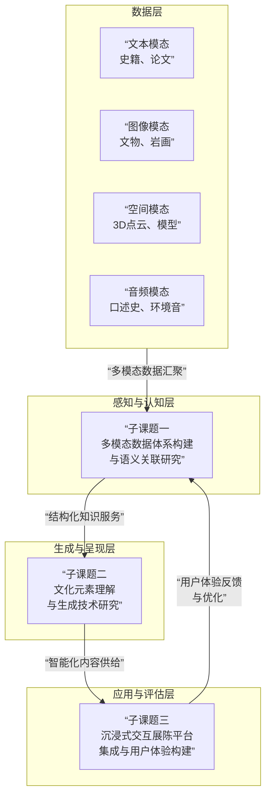

```mermaid
flowchart TD
    subgraph A [数据层]
        A1[“文本模态<br>史籍、论文”]
        A2[“图像模态<br>文物、岩画”]
        A3[“空间模态<br>3D点云、模型”]
        A4[“音频模态<br>口述史、环境音”]
    end

    subgraph B [感知与认知层]
        B1[“子课题一<br>多模态数据体系构建<br>与语义关联研究”]
    end
    
    subgraph C [生成与呈现层]
        C1[“子课题二<br>文化元素理解<br>与生成技术研究”]
    end

    subgraph D [应用与评估层]
        D1[“子课题三<br>沉浸式交互展陈平台<br>集成与用户体验构建”]
    end

    A -- “多模态数据汇聚” --> B1
    B1 -- “结构化知识服务” --> C1
    C1 -- “智能化内容供给” --> D1
    D1 -- “用户体验反馈<br>与优化” --> B1
```